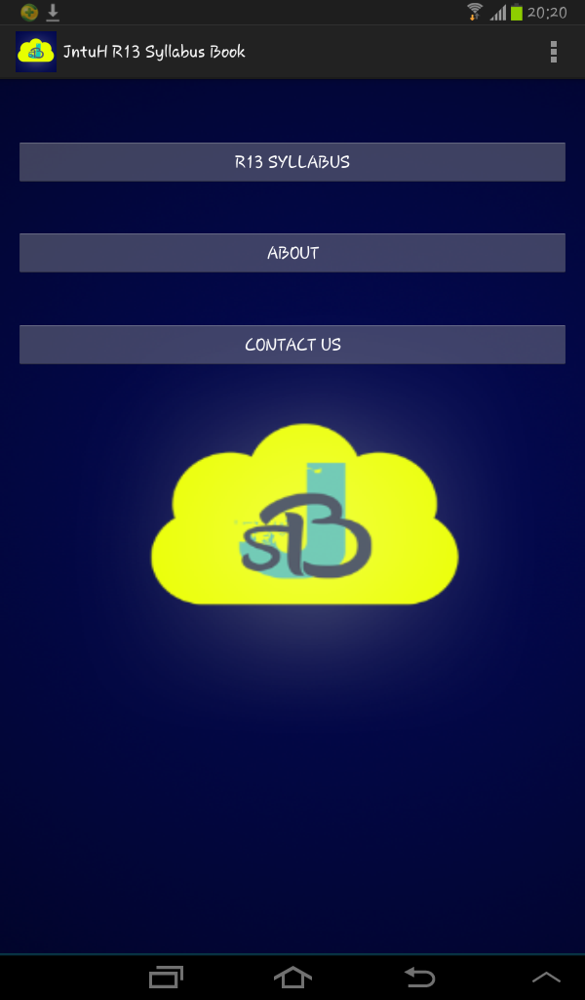

# Android
Android App - JntuHR13SyallabusBook

Designed and Developed an android application for my university, considering the R13 Syllabus book for students, using Android Studio Tool, XML, JAVA.

JNTUH R13 Syllabus Book.apk is the file can be installed in Android phone and use the application.

Screenshots

